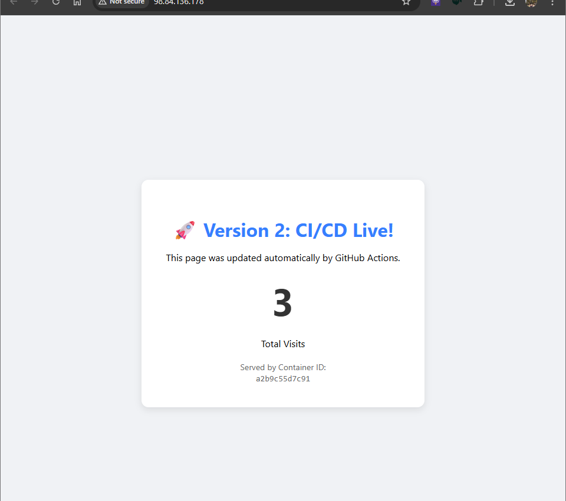

# 🚀 Python + Redis Microservices (DevOps Portfolio)

A scalable, containerized web application deployed on AWS using Docker, Kubernetes, and CI/CD pipelines.


## 🏗️ Architecture
**User** -> **AWS EC2** -> **Docker Container (Flask)** -> **Redis (Cache)**

* **Frontend:** Python (Flask) serving dynamic HTML.
* **Database:** Redis for persistent hit counting.
* **Infrastructure:** AWS EC2 (Ubuntu 24.04).
* **Orchestration:** Docker Compose (Local) & Kubernetes (Production).
* **CI/CD:** GitHub Actions (Automated build & push to Docker Hub).

## 📸 Screenshots
*(Place your screenshot of the "Version 2: CI/CD Live!" page here)*


## 🛠️ Tech Stack
* **Containerization:** Docker & Docker Hub
* **Orchestration:** Docker Compose & Kubernetes (K8s)
* **Cloud:** AWS EC2 (Security Groups, SSH, Linux Administration)
* **CI/CD:** GitHub Actions
* **Language:** Python 3.9 (Flask)

## 🚀 How to Run Locally
1.  **Clone the repo:**
    ```bash
    git clone [https://github.com/naufallofty/my-microservice-app.git](https://github.com/naufallofty/my-microservice-app.git)
    cd my-microservice-app/backend
    ```

2.  **Start with Docker Compose:**
    ```bash
    docker compose up -d
    ```

3.  **Access the App:**
    Go to `http://localhost:5000`. The visitor counter will increment on every refresh.

## ☁️ Deployment (AWS)
This project includes a CI/CD pipeline. Every push to the `main` branch triggers:
1.  **Build:** Creates a new Docker image.
2.  **Push:** Uploads the image to Docker Hub (`naufallofty/my-python-app`).
3.  **Deploy:** The AWS instance pulls the latest image and updates the live container.

---
*Built as part of the 7-Day DevOps Challenge.*
